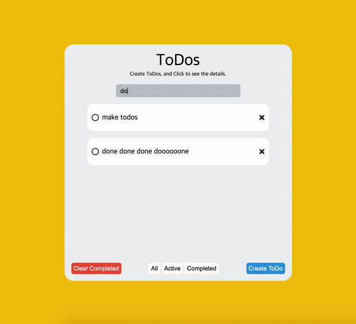
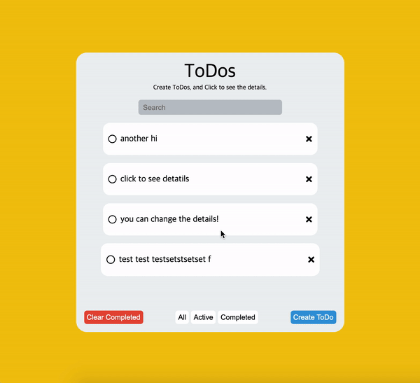
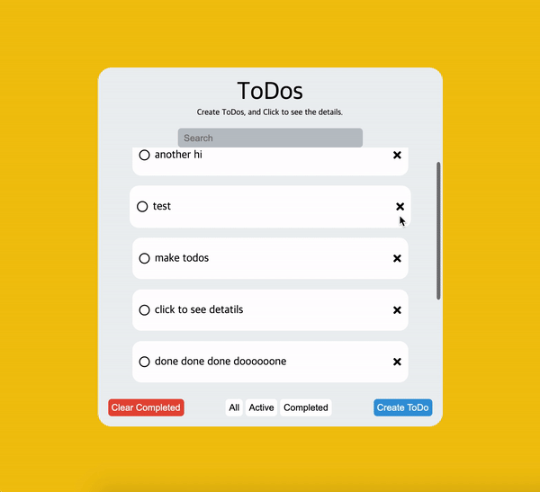
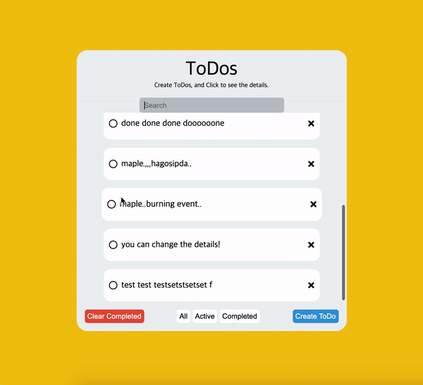

# simple-todo-list
with Vanila JS

### Main Feature

### 1. Search

### 2. Change the details 

### 3. Check Completed, Show Completed(or active..), Clear Completed

### 4. You can also delete the items

